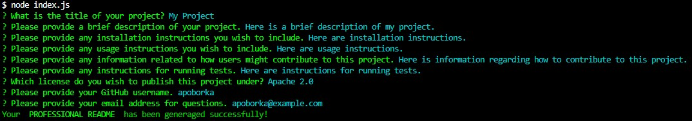
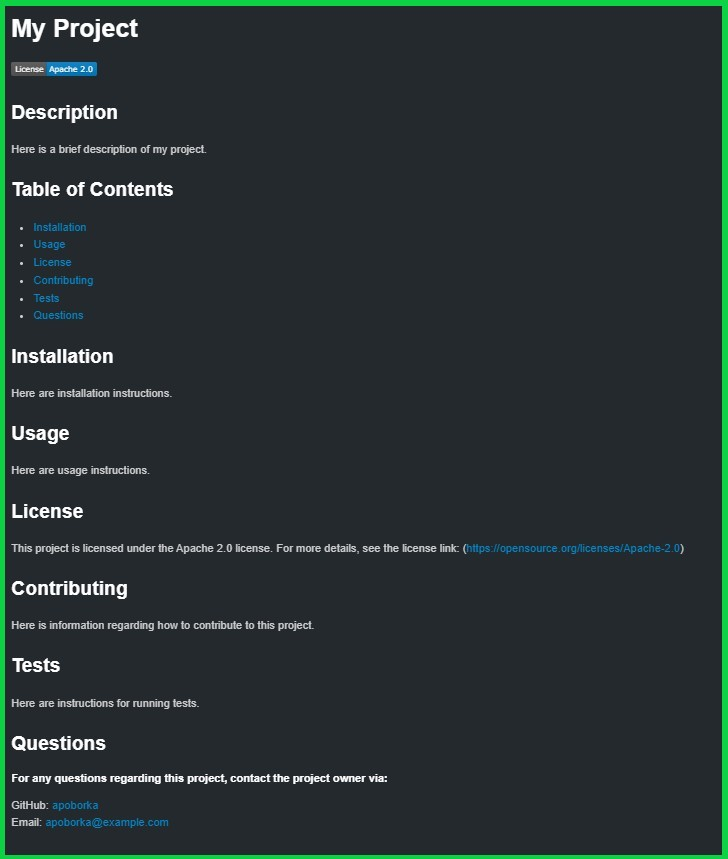

  # Pro README
  

  ## Description
  This is a CLA that generates a professional README using just nine (9) prompts. It provides features such as license badging and links to relevant documentation as well as links to the code owner's GitHub profile and email for easy community engagement. This README was created using this generator!

  

  The README generated from the above prompts:
  

  ## Table of Contents
  - [Installation](#installation)
  - [Usage](#usage)
  - [License](#license)
  - [Contributing](#contributing)
  - [Tests](#tests)
  - [Questions](#questions)

  ## Installation
  I.) Clone the repository.\
  II.) Run 'npm install' in the terminal to install dependencies (inquirer, colors).\
  III.) Run 'node index.js' in the terminal to initialize the application.

  ## Usage
  [Tutorial Video](https://drive.google.com/file/d/1DSb4hek_ddK8iOcb8NiVpPRP4THKHsjz/view?usp=sharing)

  For proper use, please note the following:\
  a.) Your project title will be the file name of the generated README file.\
  b.) When selecting a license, use the arrow and enter keys to submit your selection.\
  c.) Use correct formatting when inputting your email address.\
  d.) Your generated README file will be located in the root directory.

  ## License
  This project is licensed under the MIT license. For more details, see the license link: (https://opensource.org/licenses/MIT)

  ## Contributing
  As this is a project strictly for educational purposes, no contributions will be accepted.

  ## Tests
  There are currently no tests implemented in this program at this time.

  ## Questions
##### For any questions regarding this project, contact the project owner via: 
  GitHub: [apoborka](https://github.com/apoborka)\
  Email: alex.poborka@example.com

  ## Acknowledgments
  This project utilized Xpert Learning Assistant, an AI learning tool provided by EdX.
  Starter code was provided by EdX.
  